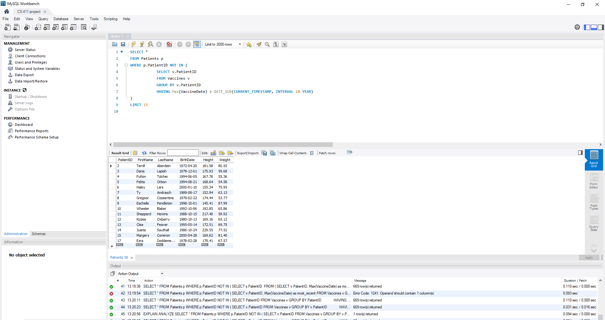

# Advanced Queries and Index Analysis

## Advanced Queries

### Query 1: Finding what symptoms a doctor has experience treating

```
SELECT DoctorID, SUM(SoreThroat) as SoreThroatCount, SUM(Headache) as HeadacheCount, SUM(StomachAche) as StomachAcheCount, SUM(Hives) as HivesCount, SUM(Cough) as CoughCount, SUM(Wound) as WoundCount, SUM(Burn) as BurnCount, SUM(MuscleAche) as MuscleAcheCount, SUM(BackPain) as BackPainCount, SUM(Acne) as AcneCount, SUM(ToothAche) as ToothAcheCount, SUM(BrokenBone) as BrokenBoneCount, AVG(Temperature) as TemperatureAvg, AVG(Height) as HeightAvg, AVG(Weight) as WeightAvg

FROM Appointments JOIN Symptoms USING(PatientID) JOIN Patients USING(PatientID)

GROUP BY DoctorID
ORDER BY DoctorID ASC
```

<center>
    
</center>

### Query 2: Finding a doctor’s patients who haven’t gotten a vaccine lately

```
SELECT *
FROM Patients p
WHERE p.PatientID NOT IN (
    SELECT v.PatientID
    FROM Vaccines v
    GROUP BY v.PatientID
    HAVING Max(VaccineDate) > DATE_SUB(CURRENT_TIMESTAMP, INTERVAL 10 YEAR)
)
```

<center>
    
</center>

## Index Analysis

### Query 1 Indexing

#### EXPLAIN ANALYZE

```
-> Sort: Appointments.DoctorID  (actual time=9.048..9.157 rows=435 loops=1)
    -> Table scan on <temporary>  (actual time=0.003..0.032 rows=435 loops=1)
        -> Aggregate using temporary table  (actual time=8.283..8.338 rows=435 loops=1)
            -> Nested loop inner join  (cost=874.45 rows=1727) (actual time=0.738..5.147 rows=2445 loops=1)
                -> Nested loop inner join  (cost=451.25 rows=1000) (actual time=0.716..2.369 rows=1000 loops=1)
                    -> Table scan on Symptoms  (cost=101.25 rows=1000) (actual time=0.694..1.400 rows=1000 loops=1)
                        -> Single-row index lookup on Patients using PRIMARY (PatientID=Symptoms.PatientID)  (cost=0.25 rows=1) (actual time=0.001..0.001 rows=1 loops=1000)
                            -> Index lookup on Appointments using PRIMARY (PatientID=Symptoms.PatientID)  (cost=0.25 rows=2) (actual time=0.002..0.002 rows=2 loops=1000)
```

Total time: 26.446ms

#### Indexing by SoreThroat

```
-> Sort: Appointments.DoctorID  (actual time=8.424..8.624 rows=435 loops=1)
    -> Table scan on <temporary>  (actual time=0.003..0.120 rows=435 loops=1)
        -> Aggregate using temporary table  (actual time=7.729..7.947 rows=435 loops=1)
            -> Nested loop inner join  (cost=874.45 rows=1727) (actual time=0.178..4.744 rows=2445 loops=1)
                -> Nested loop inner join  (cost=451.25 rows=1000) (actual time=0.159..1.909 rows=1000 loops=1)
                    -> Table scan on Symptoms  (cost=101.25 rows=1000) (actual time=0.141..0.843 rows=1000 loops=1)
                        -> Single-row index lookup on Patients using PRIMARY (PatientID=Symptoms.PatientID)  (cost=0.25 rows=1) (actual time=0.001..0.001 rows=1 loops=1000)
                            -> Index lookup on Appointments using PRIMARY (PatientID=Symptoms.PatientID)  (cost=0.25 rows=2) (actual time=0.002..0.003 rows=2 loops=1000)
```

Total time: 24.191ms

#### Indexing by Height

```
-> Sort: Appointments.DoctorID  (actual time=12.615..12.731 rows=435 loops=1)
    -> Table scan on <temporary>  (actual time=0.001..0.030 rows=435 loops=1)
        -> Aggregate using temporary table  (actual time=12.264..12.318 rows=435 loops=1)
            -> Nested loop inner join  (cost=874.45 rows=1727) (actual time=0.096..5.848 rows=2445 loops=1)
                -> Nested loop inner join  (cost=451.25 rows=1000) (actual time=0.084..2.286 rows=1000 loops=1)
                    -> Table scan on Symptoms  (cost=101.25 rows=1000) (actual time=0.073..1.050 rows=1000 loops=1)
                        -> Single-row index lookup on Patients using PRIMARY (PatientID=Symptoms.PatientID)  (cost=0.25 rows=1) (actual time=0.001..0.001 rows=1 loops=1000)
                            -> Index lookup on Appointments using PRIMARY (PatientID=Symptoms.PatientID)  (cost=0.25 rows=2) (actual time=0.002..0.003 rows=2 loops=1000)
```

Total time: 34.267ms

#### Indexing by SoreThroat and Height

```
-> Sort: Appointments.DoctorID  (actual time=7.687..7.811 rows=435 loops=1)
    -> Table scan on <temporary>  (actual time=0.001..0.026 rows=435 loops=1)
        -> Aggregate using temporary table  (actual time=7.398..7.448 rows=435 loops=1)
            -> Nested loop inner join  (cost=874.45 rows=1727) (actual time=0.126..4.463 rows=2445 loops=1)
                -> Nested loop inner join  (cost=451.25 rows=1000) (actual time=0.111..1.698 rows=1000 loops=1)
                    -> Table scan on Symptoms  (cost=101.25 rows=1000) (actual time=0.097..0.790 rows=1000 loops=1)
                        -> Single-row index lookup on Patients using PRIMARY (PatientID=Symptoms.PatientID)  (cost=0.25 rows=1) (actual time=0.001..0.001 rows=1 loops=1000)
                            -> Index lookup on Appointments using PRIMARY (PatientID=Symptoms.PatientID)  (cost=0.25 rows=2) (actual time=0.002..0.002 rows=2 loops=1000)'
```

Total time: 22.239ms

#### Explanation

This query finds what symptoms each doctor has experience in treating by summing up the counts of each symptom in all of their appointments. The total time without indexing is 26.446ms. The total time for running with indexing on SoreThroat is 24.191 which is less than the time without indexing. This is because similar values of SoreThroat are grouped together with indexing so that when the values are aggregated in the sum, the process is faster. However, when indexing on the Patients’ heights, the total time is 34.267ms which is greater than the original time. Since the height is not involved in any searching or aggregations, there is no benefit for indexing by height and it only adds an extra step, which increases the time. When indexing by both SoreThroat and Height, the total time is 22.239ms. The indexing improved the runtime since values that are aggregated at the end (SoreThroat), are grouped together which speeds up the process. 

### Query 2 Indexing

#### EXPLAIN ANALYZE

```
-> Filter: <in_optimizer>(p.PatientID,p.PatientID in (select #2) is false)  (cost=101.25 rows=1000) (actual time=0.630..1.840 rows=669 loops=1)
    -> Table scan on p  (cost=101.25 rows=1000) (actual time=0.057..0.434 rows=1000 loops=1)    -> Select #2 (subquery in condition; run only once)
        -> Filter: ((p.PatientID = `<materialized_subquery>`.PatientID))  (actual time=0.000..0.000 rows=0 loops=1001)
            -> Limit: 1 row(s)  (actual time=0.000..0.000 rows=0 loops=1001)                
                -> Index lookup on <materialized_subquery> using <auto_distinct_key> (PatientID=p.PatientID)  (actual time=0.000..0.000 rows=0 loops=1001)
                    -> Materialize with deduplication  (cost=301.25..301.25 rows=1000) (actual time=1.147..1.147 rows=331 loops=1)
                        -> Filter: (max(v.VaccineDate) > <cache>((now() - interval 10 year)))  (cost=201.25 rows=1000) (actual time=0.040..0.502 rows=331 loops=1)
                            -> Group aggregate: max(v.VaccineDate)  (cost=201.25 rows=1000) (actual time=0.034..0.446 rows=572 loops=1)
                                -> Index scan on v using PRIMARY  (cost=101.25 rows=1000) (actual time=0.024..0.261 rows=1000 loops=1)
```

Total Time: 4.63ms

#### Index on VaccineDate

```
-> Filter: <in_optimizer>(p.PatientID,p.PatientID in (select #2) is false)  (cost=101.25 rows=1000) (actual time=0.709..1.907 rows=669 loops=1)
    -> Table scan on p  (cost=101.25 rows=1000) (actual time=0.120..0.468 rows=1000 loops=1)
        -> Select #2 (subquery in condition; run only once)
            -> Filter: ((p.PatientID = `<materialized_subquery>`.PatientID))  (actual time=0.000..0.000 rows=0 loops=1001)
                -> Limit: 1 row(s)  (actual time=0.000..0.000 rows=0 loops=1001)
                    -> Index lookup on <materialized_subquery> using <auto_distinct_key> (PatientID=p.PatientID)  (actual time=0.000..0.000 rows=0 loops=1001)
                        -> Materialize with deduplication  (cost=301.25..301.25 rows=1000) (actual time=1.146..1.146 rows=331 loops=1)
                            -> Filter: (max(v.VaccineDate) > <cache>((now() - interval 10 year)))  (cost=201.25 rows=1000) (actual time=0.064..0.515 rows=331 loops=1)
                                -> Group aggregate: max(v.VaccineDate)  (cost=201.25 rows=1000) (actual time=0.058..0.461 rows=572 loops=1)
                                    -> Index scan on v using PRIMARY  (cost=101.25 rows=1000) (actual time=0.048..0.279 rows=1000 loops=1)
```

Total Time: 4.776ms

#### Index on first name

```
-> Filter: <in_optimizer>(p.PatientID,p.PatientID in (select #2) is false)  (cost=101.25 rows=1000) (actual time=0.695..1.984 rows=669 loops=1)
    -> Table scan on p  (cost=101.25 rows=1000) (actual time=0.055..0.473 rows=1000 loops=1)
    -> Select #2 (subquery in condition; run only once)
        -> Filter: ((p.PatientID = `<materialized_subquery>`.PatientID))  (actual time=0.000..0.000 rows=0 loops=1001)
            -> Limit: 1 row(s)  (actual time=0.000..0.000 rows=0 loops=1001)
                -> Index lookup on <materialized_subquery> using <auto_distinct_key> (PatientID=p.PatientID)  (actual time=0.000..0.000 rows=0 loops=1001)
                    -> Materialize with deduplication  (cost=301.25..301.25 rows=1000) (actual time=1.236..1.236 rows=331 loops=1)
                        -> Filter: (max(v.VaccineDate) > <cache>((now() - interval 10 year)))  (cost=201.25 rows=1000) (actual time=0.045..0.563 rows=331 loops=1)
                            -> Group aggregate: max(v.VaccineDate)  (cost=201.25 rows=1000) (actual time=0.038..0.501 rows=572 loops=1)
                                -> Index scan on v using PRIMARY  (cost=101.25 rows=1000) (actual time=0.028..0.274 rows=1000 loops=1)
```

Total Time: 5.031ms

#### Index on BirthDate

```
-> Filter: <in_optimizer>(p.PatientID,p.PatientID in (select #2) is false)  (cost=101.25 rows=1000) (actual time=0.689..1.883 rows=669 loops=1)
    -> Table scan on p  (cost=101.25 rows=1000) (actual time=0.047..0.437 rows=1000 loops=1)
    -> Select #2 (subquery in condition; run only once)
        -> Filter: ((p.PatientID = `<materialized_subquery>`.PatientID))  (actual time=0.000..0.000 rows=0 loops=1001)
            -> Limit: 1 row(s)  (actual time=0.000..0.000 rows=0 loops=1001)
                -> Index lookup on <materialized_subquery> using <auto_distinct_key> (PatientID=p.PatientID)  (actual time=0.000..0.000 rows=0 loops=1001)
                    -> Materialize with deduplication  (cost=301.25..301.25 rows=1000) (actual time=1.188..1.188 rows=331 loops=1)
                        -> Filter: (max(v.VaccineDate) > <cache>((now() - interval 10 year)))  (cost=201.25 rows=1000) (actual time=0.040..0.563 rows=331 loops=1)
                            -> Group aggregate: max(v.VaccineDate)  (cost=201.25 rows=1000) (actual time=0.034..0.504 rows=572 loops=1)
                                -> Index scan on v using PRIMARY  (cost=101.25 rows=1000) (actual time=0.024..0.282 rows=1000 loops=1)'
```

Total Time: 4.857ms

#### Index on firstname and birthdate

```
-> Filter: <in_optimizer>(p.PatientID,p.PatientID in (select #2) is false)  (cost=101.25 rows=1000) (actual time=0.653..1.860 rows=669 loops=1)
    -> Table scan on p  (cost=101.25 rows=1000) (actual time=0.045..0.415 rows=1000 loops=1)
    -> Select #2 (subquery in condition; run only once)
        -> Filter: ((p.PatientID = `<materialized_subquery>`.PatientID))  (actual time=0.000..0.000 rows=0 loops=1001)
            -> Limit: 1 row(s)  (actual time=0.000..0.000 rows=0 loops=1001)
                -> Index lookup on <materialized_subquery> using <auto_distinct_key> (PatientID=p.PatientID)  (actual time=0.000..0.000 rows=0 loops=1001)
                    -> Materialize with deduplication  (cost=301.25..301.25 rows=1000) (actual time=1.158..1.158 rows=331 loops=1)
                        -> Filter: (max(v.VaccineDate) > <cache>((now() - interval 10 year)))  (cost=201.25 rows=1000) (actual time=0.037..0.535 rows=331 loops=1)
                            -> Group aggregate: max(v.VaccineDate)  (cost=201.25 rows=1000) (actual time=0.031..0.476 rows=572 loops=1)
                                -> Index scan on v using PRIMARY  (cost=101.25 rows=1000) (actual time=0.022..0.253 rows=1000 loops=1)
```

Total Time: 4.697ms

#### Explanation

Explanation: In this query we are trying to find patients who have had no vaccines in the last 10 years. The total time is 4.63ms without indexing, with our indexes it runs from 4.697ms to 5.031ms which all take more time than without indexing. The reason using an index does not really help in this case as we are not finding exact matches in our query instead we are finding rows which do not match the PatientIDs we have. In this case indexing just adds a step and we still have to iterate through the whole table to ensure that the results are not in the table. If we were somehow able to make a query that instead used IN instead of NOT IN indexing would probably help.
