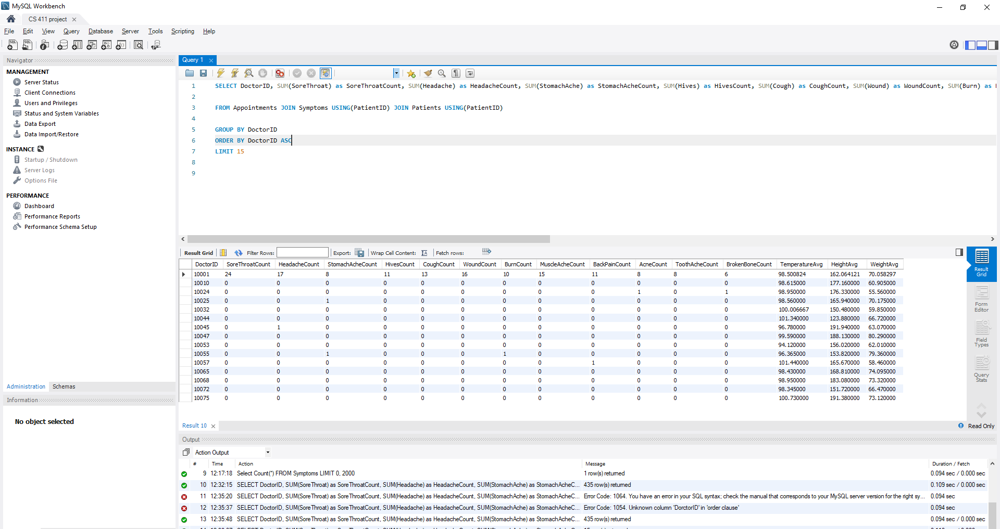

# Advanced Queries and Index Analysis

## Advanced Queries

### Query 1: Finding what symptoms a doctor has experience treating

```
SELECT DoctorID, SUM(SoreThroat) as SoreThroatCount, SUM(Headache) as HeadacheCount, SUM(StomachAche) as StomachAcheCount, SUM(Hives) as HivesCount, SUM(Cough) as CoughCount, SUM(Wound) as WoundCount, SUM(Burn) as BurnCount, SUM(MuscleAche) as MuscleAcheCount, SUM(BackPain) as BackPainCount, SUM(Acne) as AcneCount, SUM(ToothAche) as ToothAcheCount, SUM(BrokenBone) as BrokenBoneCount, AVG(Temperature) as TemperatureAvg, AVG(Height) as HeightAvg, AVG(Weight) as WeightAvg

FROM Appointments JOIN Symptoms USING(PatientID) JOIN Patients USING(PatientID)

GROUP BY DoctorID
ORDER BY DoctorID ASC
```

<center>
    
</center>

## Index Analysis

### Query 1 Indexing

#### EXPLAIN ANALYZE

```
'-> Sort: Appointments.DoctorID  (actual time=9.048..9.157 rows=435 loops=1)\n
    -> Table scan on <temporary>  (actual time=0.003..0.032 rows=435 loops=1)\n
        -> Aggregate using temporary table  (actual time=8.283..8.338 rows=435 loops=1)\n
            -> Nested loop inner join  (cost=874.45 rows=1727) (actual time=0.738..5.147 rows=2445 loops=1)\n
                -> Nested loop inner join  (cost=451.25 rows=1000) (actual time=0.716..2.369 rows=1000 loops=1)\n
                    -> Table scan on Symptoms  (cost=101.25 rows=1000) (actual time=0.694..1.400 rows=1000 loops=1)\n
                        -> Single-row index lookup on Patients using PRIMARY (PatientID=Symptoms.PatientID)  (cost=0.25 rows=1) (actual time=0.001..0.001 rows=1 loops=1000)\n
                            -> Index lookup on Appointments using PRIMARY (PatientID=Symptoms.PatientID)  (cost=0.25 rows=2) (actual time=0.002..0.002 rows=2 loops=1000)\n'
```

Total time: ms

#### Indexing by SoreThroat

```
'-> Sort: Appointments.DoctorID  (actual time=8.424..8.624 rows=435 loops=1)\n
    -> Table scan on <temporary>  (actual time=0.003..0.120 rows=435 loops=1)\n
        -> Aggregate using temporary table  (actual time=7.729..7.947 rows=435 loops=1)\n
            -> Nested loop inner join  (cost=874.45 rows=1727) (actual time=0.178..4.744 rows=2445 loops=1)\n
                -> Nested loop inner join  (cost=451.25 rows=1000) (actual time=0.159..1.909 rows=1000 loops=1)\n
                    -> Table scan on Symptoms  (cost=101.25 rows=1000) (actual time=0.141..0.843 rows=1000 loops=1)\n
                        -> Single-row index lookup on Patients using PRIMARY (PatientID=Symptoms.PatientID)  (cost=0.25 rows=1) (actual time=0.001..0.001 rows=1 loops=1000)\n
                            -> Index lookup on Appointments using PRIMARY (PatientID=Symptoms.PatientID)  (cost=0.25 rows=2) (actual time=0.002..0.003 rows=2 loops=1000)\n'
```

Total time: ms

#### Indexing by Height

```
'-> Sort: Appointments.DoctorID  (actual time=12.615..12.731 rows=435 loops=1)\n
    -> Table scan on <temporary>  (actual time=0.001..0.030 rows=435 loops=1)\n
        -> Aggregate using temporary table  (actual time=12.264..12.318 rows=435 loops=1)\n
            -> Nested loop inner join  (cost=874.45 rows=1727) (actual time=0.096..5.848 rows=2445 loops=1)\n
                -> Nested loop inner join  (cost=451.25 rows=1000) (actual time=0.084..2.286 rows=1000 loops=1)\n
                    -> Table scan on Symptoms  (cost=101.25 rows=1000) (actual time=0.073..1.050 rows=1000 loops=1)\n
                        -> Single-row index lookup on Patients using PRIMARY (PatientID=Symptoms.PatientID)  (cost=0.25 rows=1) (actual time=0.001..0.001 rows=1 loops=1000)\n
                            -> Index lookup on Appointments using PRIMARY (PatientID=Symptoms.PatientID)  (cost=0.25 rows=2) (actual time=0.002..0.003 rows=2 loops=1000)\n'
```

Total time: ms

#### Indexing by SoreThroat and Height

'-> Sort: Appointments.DoctorID  (actual time=7.687..7.811 rows=435 loops=1)\n
    -> Table scan on <temporary>  (actual time=0.001..0.026 rows=435 loops=1)\n
        -> Aggregate using temporary table  (actual time=7.398..7.448 rows=435 loops=1)\n
            -> Nested loop inner join  (cost=874.45 rows=1727) (actual time=0.126..4.463 rows=2445 loops=1)\n
                -> Nested loop inner join  (cost=451.25 rows=1000) (actual time=0.111..1.698 rows=1000 loops=1)\n
                    -> Table scan on Symptoms  (cost=101.25 rows=1000) (actual time=0.097..0.790 rows=1000 loops=1)\n
                        -> Single-row index lookup on Patients using PRIMARY (PatientID=Symptoms.PatientID)  (cost=0.25 rows=1) (actual time=0.001..0.001 rows=1 loops=1000)\n
                            -> Index lookup on Appointments using PRIMARY (PatientID=Symptoms.PatientID)  (cost=0.25 rows=2) (actual time=0.002..0.002 rows=2 loops=1000)\n'

#### Explanation


### Query 2 Indexing

#### Explain Analyze
