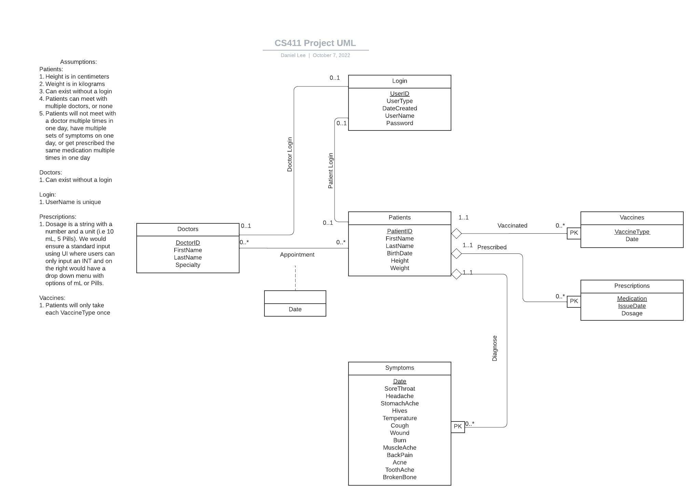

# DocHunt: Conceptual and Logical Design

## UML Diagram

<center>
    
    <figcaption>UML Diagram</figccaptoin>
</center>

## Relational Schema

```
Relational Schema

Doctors(DoctorID: VARCHAR(20) [PK], FirstName:VARCHAR(50), LastName:VARCHAR(5), Specialty:VARCHAR(255))

Patients(PatientID:VARCHAR(20) [PK], FirstName: VARCHAR(50), LastName: VARCHAR(50), BirthDate: DATE, Height: REAL, Weight: REAL)

Symptoms(PatientID:VARCHAR(20) [PK] [FK to Patients.PatientID], Date:DATE [PK], SoreThroat:BIT, Headache:BIT, StomachAche:BIT, Hives:BIT, Temperature:BIT, Cough:BIT, Wound:BIT, Burn:BIT, MuscleAche:BIT, BackPain:BIT, Acne:BIT, ToothAche:BIT, BrokenBone:BIT)

Appointments(PatientID:VARCHAR(20) [PK] [FK to Patients.PatientID], DoctorID:VARCHAR[20] [PK] [FK to Doctors.DoctorID], ApptDate:DATE [PK])

Prescriptions(PatientID: VARCHAR(20) [PK] [FK to Patients.PatientID], Medication: VARCHAR(255) [PK], IssueDate: DATE[PK], Dosage:INT)

Vaccines(PatientID: VARCHAR(20) [PK] [FK to Patients.PatientID], VaccineType: VARCHAR[255] [PK], Date: DATE)

Login(UserID: VARCHAR(20) [PK], UserType: VARCHAR(20), DateCreated:DATE, UserName: VARCHAR(50), Password: VARCHAR(50))
________________________

Description of Relations

Doctor Login: A doctor can be a user or not one. This relation is a one to one relationship, but need not necessarily exist as not every doctor will choose to use the database. Note doctors will probably have higher database privileges to update, insert, and delete entries from the database.

Patient Login: A patient can be a user or not one. This relation is a one to one relationship, but need not necessarily exist as not every doctor will choose to use the database. Note patients will have lower database privileges than doctors but might still be able to to update insert and delete certain entities in the database.

Diagnose: A user doctor would be able to input a diagnosis for a patient for a specific date. A patient can have zero to many diagnoses and a diagnosis can only be tied to one patient (one is to one). This is a weak entity set as if we delete the patient all the diagnoses related to that patient should also be deleted.

Vaccinated: A user doctor would be able to input a vaccination for a patient for a specific date. A patient can have zero to many vaccinations and a vaccination date can only be tied to one patient (one is to one) This is a weak entity set as if we delete the patient all the related vaccinations to that patient should also be deleted.

Prescribed: A user doctor would be able to input a prescriptions for a patient for a specific date. A patient can have zero to many prescriptions and a prescription can only be tied to one patient (one is to one). This is a weak entity set as if we delete the patient all the medication related to that patient should also be deleted.

Appointment:A user doctor would be able to input a appointment for a patient for a specific date. This relation is a zero to many relationship. This most importantly ties doctors and patients together in a zero to many relationship.
```


