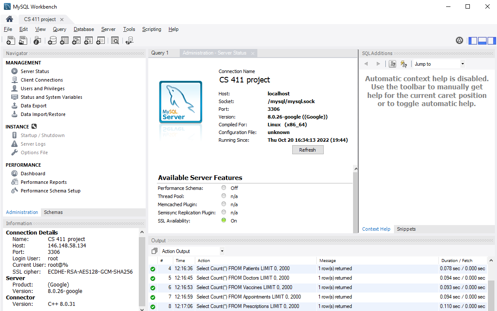
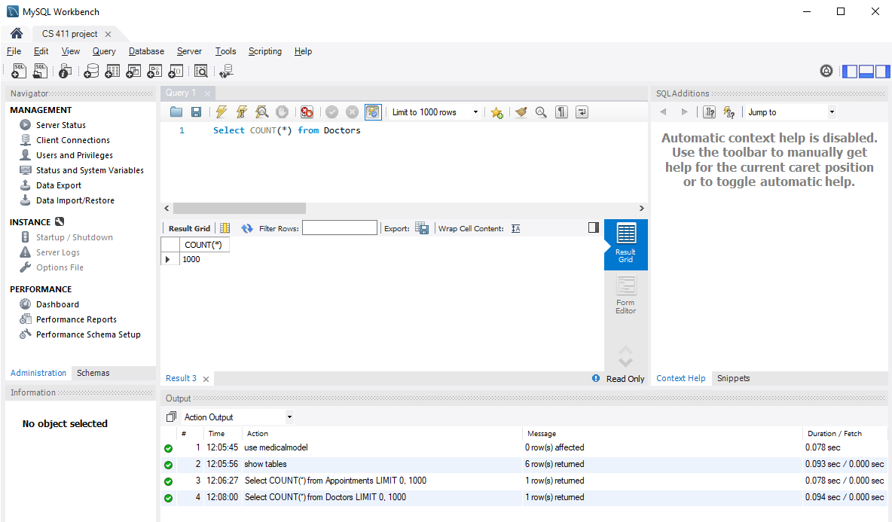
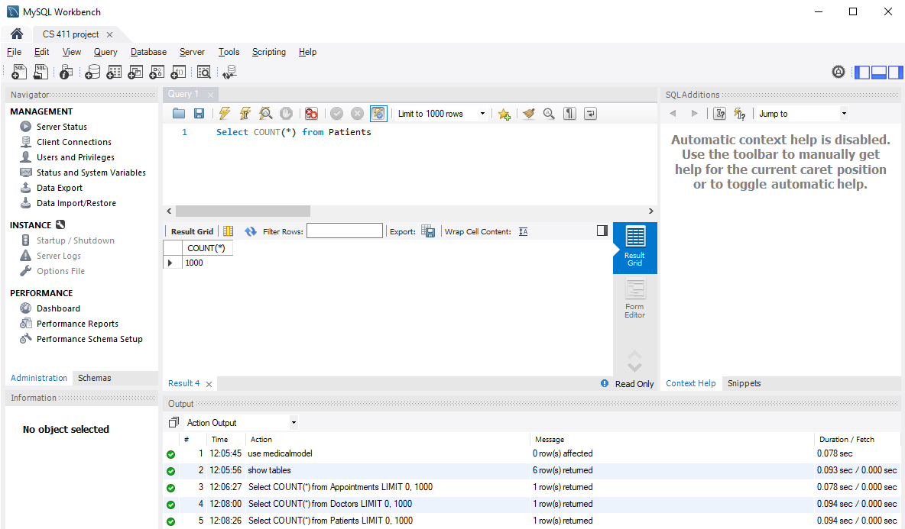
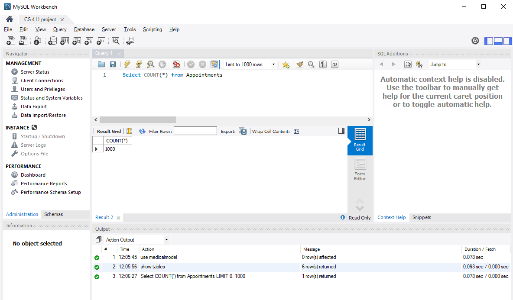
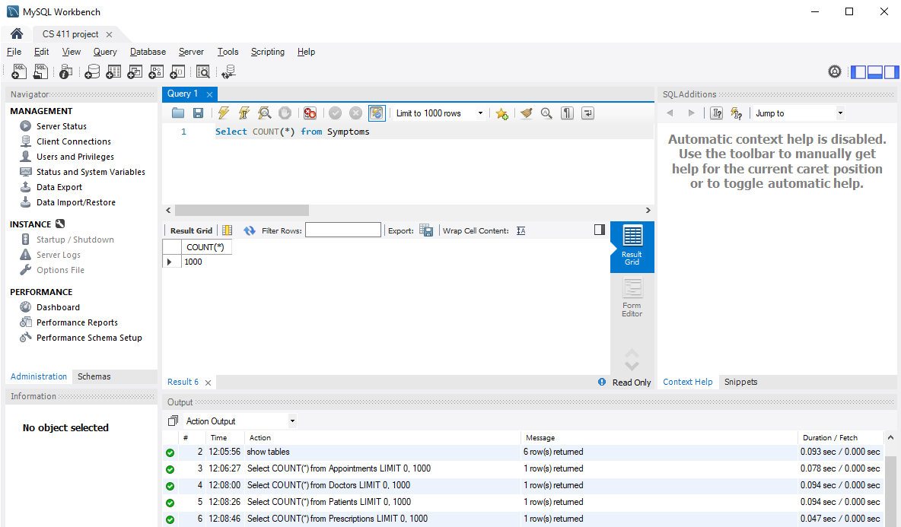
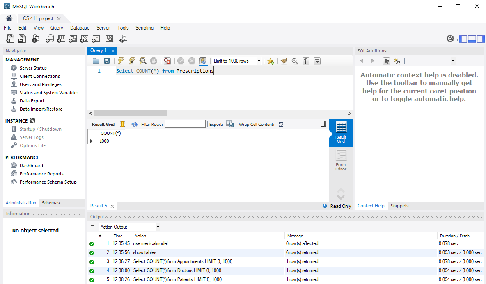
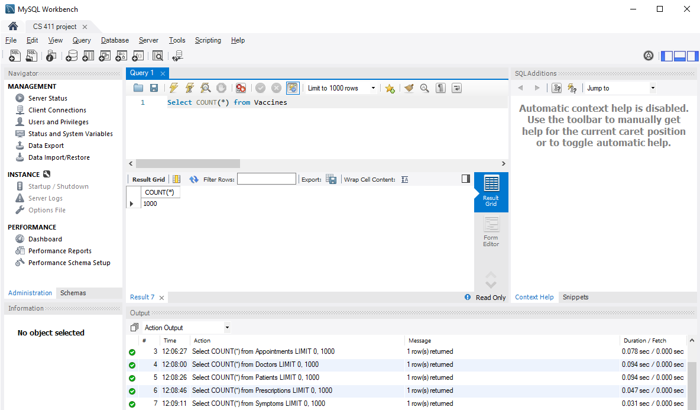

# Database Design

## Database Connection

<center>
	
</center>

## Tables

### Doctors Table

```
create table Doctors (
	DoctorID INT,
	FirstName VARCHAR(50),
	LastName VARCHAR(50),
	Specialty VARCHAR(36),
	PRIMARY KEY (DoctorID)
);
```

<center>
    
</center>

### Patients Table

```
create table Patients (
	PatientID INT PRIMARY KEY,
	FirstName VARCHAR(50),
	LastName VARCHAR(50),
	BirthDate DATE,
	Height DECIMAL(5,2),
	Weight DECIMAL(4,2)
);
```

<center>
    
</center>

### Appointments Table

```
create table Appointments (
	PatientID INT,
	DoctorID INT,
	ApptDate DATE,
	PRIMARY KEY (PatientID, DoctorID, ApptDate),
    FOREIGN KEY (PatientID) REFERENCES Patients(PatientID) ON DELETE CASCADE,
	FOREIGN KEY (DoctorID) REFERENCES Doctors(DoctorID) ON DELETE CASCADE
);
```

<center>
    
</center>

### Symptoms Table

```
create table Symptoms (
	PatientID INT,
	DigDate DATE,
	SoreThroat VARCHAR(50),
	Headache VARCHAR(50),
	StomachAche VARCHAR(50),
	Hives VARCHAR(50),
	Temperature DECIMAL(5,2),
	Cough VARCHAR(50),
	Wound VARCHAR(50),
	Burn VARCHAR(50),
	MuscleAche VARCHAR(50),
	BackPain VARCHAR(50),
	Acne VARCHAR(50),
	ToothAche VARCHAR(50),
	BrokenBone VARCHAR(50),
	PRIMARY KEY (PatientID, DigDate)
);
```

<center>
    
</center>

## Prescriptions Table

```
CREATE TABLE Prescriptions(
    PatientID INT,
    Prescriptions VARCHAR(50),
    IssueDate DATE,
    Dosage INT,
    PRIMARY KEY (PatientID, Prescriptions, IssueDate),
    FOREIGN KEY (PatientID) REFERENCES Patients(PatientID) ON DELETE CASCADE
);
```

<center>
    
</center>

## Vaccines Table

```
create table Vaccines (
	PatientID INT,
	VaccineType VARCHAR(12),
	VaccineDate DATE,
	PRIMARY KEY (PatientID, VaccineType, VaccineDate),
	FOREIGN KEY (PatientID) REFERENCES Patients(PatientID) ON DELETE CASCADE
);
```

<center>
    
</center>

## NOTE
Please have a look at AdvancedQueries.md for the time analysis of the queries together with the different indexes we chose and the explainations for why we chose them.